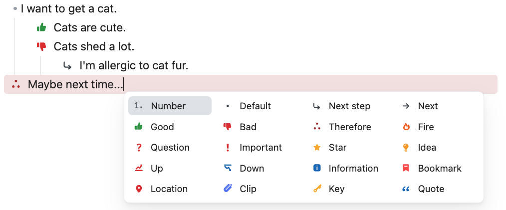

# Icon Bullet Helper

[ [English](https://github.com/jaewonE/icon-bullet-helper) | [한국어](https://github.com/jaewonE/icon-bullet-helper/blob/master/README.ko.md) ]



Icon Bullet Helper는 일반 Markdown 문법을 유지하면서 Obsidian 목록에 시각적인 아이콘 bullet을 표시하는 플러그인입니다.

```markdown
- {p} 상태가 좋음
- {!important} 주의 필요
- {next-step} 내일 후속 작업
```

플러그인은 Live Preview와 Reading view에서 marker 문법을 SVG 아이콘으로 렌더링합니다. 원본 Markdown 텍스트는 그대로 유지되므로 다른 Markdown 환경에서도 읽을 수 있습니다.

## 주요 기능

- `{marker}` 문법을 테마에 의존하지 않는 SVG 아이콘 bullet로 렌더링합니다.
- `{!marker}` 문법을 배경색이 있는 callout 아이콘 bullet로 렌더링합니다.
- Source view와 fenced code block 안에서는 원본 텍스트를 그대로 보여줍니다.
- macOS에서는 `Command + ;`, Windows/Linux에서는 `Ctrl + ;`로 picker를 열 수 있습니다.
- 목록 marker 뒤에 trigger를 입력해 picker를 열 수 있습니다. 기본값은 `- !`입니다.
- picker 안에서 방향키, 마우스 hover, click, `Space`, `Enter`, `Escape`를 사용할 수 있습니다.
- `Space`는 common marker를 삽입하고, `Enter`는 callout marker를 삽입합니다.
- 현재 marker는 macOS `Command + .`, Windows/Linux `Ctrl + .`로 common/callout 상태를 전환할 수 있습니다.
- marker 이름, label, 색상, callout 배경색, SVG, picker layout을 설정할 수 있습니다.
- Disabled 항목은 picker에서 숨겨지지만 기존 노트의 marker 렌더링은 유지됩니다.
- 별도 dark-mode 설정 없이 light/dark theme에서 읽기 좋은 색상으로 조정됩니다.

## 문법

Common 아이콘 bullet:

```markdown
- {p} 상태가 좋음
```

Callout 아이콘 bullet:

```markdown
- {!p} 상태가 좋음
```

Marker는 영문자, 숫자, 밑줄, 하이픈을 사용할 수 있습니다. 설정 UI에서는 공백이 하이픈으로 정규화됩니다.

Live Preview의 아이콘 marker 렌더링은 현재 unordered Markdown list marker를 대상으로 합니다.

```markdown
- {p} Dash list
* {i} Asterisk list
+ {q} Plus list
```

Reading view에서는 Obsidian이 list item을 파싱한 뒤 marker를 렌더링합니다. Source view와 fenced code block에서는 항상 원본 텍스트가 보입니다.

## Picker

Picker는 다음 방식으로 열 수 있습니다.

- **Icon Bullet Helper: Open icon bullet picker** 명령 실행
- Markdown list marker 뒤에 picker trigger 입력. 예: `- !`

기본 조작:

| 동작 | 단축키 |
| --- | --- |
| 선택 이동 | 방향키 |
| Common marker 삽입 | `Space` |
| Callout marker 삽입 | `Enter` |
| Picker 닫기 | `Escape` |
| 현재 marker common/callout 전환 | `Command + .` 또는 `Ctrl + .` |

추가 단축키는 Obsidian의 **Hotkeys** 설정에서 picker 및 toggle 명령에 직접 할당할 수 있습니다.

## 기본 항목

Picker에는 두 종류의 항목이 있습니다.

아이콘 marker 항목은 SVG 아이콘 bullet로 렌더링됩니다.

| Marker | Label |
| --- | --- |
| `{next-step}` | Next step |
| `{next}` | Next |
| `{therefore}` | Therefore |
| `{clip}` | Clip |
| `{p}` | Good |
| `{c}` | Bad |
| `{q}` | Question |
| `{important}` | Important |
| `{bookmark}` | Bookmark |
| `{star}` | Star |
| `{fire}` | Fire |
| `{up}` | Up |
| `{down}` | Down |
| `{forwarded}` | Forwarded |
| `{scheduling}` | Scheduling |
| `{i}` | Information |
| `{location}` | Location |
| `{quote}` | Quote |
| `{dollar}` | Dollar |
| `{idea}` | Idea |
| `{k}` | Key |
| `{win}` | Win |

Insert helper 항목은 일반 Markdown 문법을 삽입하며 SVG marker 항목이 아닙니다.

| Picker item | 삽입 텍스트 |
| --- | --- |
| Number | `1. ` |
| Default | `- ` |
| Unchecked | `- [ ] ` |
| Incomplete | `- [/] ` |
| Checked | `- [x] ` |

## 설정

설정은 세 개의 탭으로 나뉩니다.

### General

- Picker 크기를 변경합니다.
- Picker trigger 텍스트를 변경합니다. 기본값은 `!`입니다.
- Picker 단축키 동작을 확인합니다.
- 모든 플러그인 설정을 기본값으로 복원합니다.

### Icon Layout

- Picker에 표시되는 enabled grid 크기를 columns x rows로 설정합니다.
- Drag and drop으로 picker 내부 아이콘 순서를 변경합니다.
- 아이콘을 Disabled 영역으로 옮겨 picker에서 숨깁니다.
- Disabled 아이콘을 grid로 되돌려 다시 활성화합니다.

최소 한 개의 아이콘은 enabled 상태로 유지됩니다. Disabled된 아이콘 marker 항목은 picker에서 숨겨지지만 기존 노트의 렌더링은 유지됩니다.

### Icon Bullets

- Custom marker를 추가합니다.
- Picker 항목을 enable 또는 disable합니다.
- Marker 이름, label, 색상, callout 배경색, SVG를 수정합니다.
- Custom marker를 삭제합니다.

일부 SVG는 `fill` 또는 `stroke` 색상을 직접 가지고 있습니다. Color 설정은 `currentColor`를 사용하는 SVG 부분에만 적용됩니다.

## Custom SVG 안전성

Custom SVG는 저장 및 렌더링 전에 sanitize됩니다. Sanitizer는 script, event handler, 외부 resource, unsafe URL, `foreignObject` 같은 unsupported embedded content를 제거합니다.

권장 SVG 형식:

- `viewBox` 포함
- 색상 변경이 필요한 path는 `currentColor` 사용
- 외부 asset 사용 금지
- 너무 얇은 outline-only 형태 지양

## 개인정보 및 네트워크 접근

Icon Bullet Helper는 Obsidian 내부에서 로컬로 동작합니다.

- 노트, 설정, SVG, 사용 데이터를 외부 서비스로 전송하지 않습니다.
- Telemetry를 사용하지 않습니다.
- 설정은 현재 vault의 Obsidian plugin data file에 저장됩니다.

## 설치

### Community Plugins에서 설치

Obsidian Community Plugins directory에 등록된 이후:

1. Obsidian에서 **Settings**를 엽니다.
2. **Community plugins**로 이동합니다.
3. **Icon Bullet Helper**를 검색합니다.
4. 플러그인을 설치하고 활성화합니다.

### 수동 설치

최신 GitHub release에서 다음 파일을 다운로드합니다.

- `main.js`
- `manifest.json`
- `styles.css`

아래 위치에 복사합니다.

```text
<Vault>/.obsidian/plugins/icon-bullet-helper/
```

Obsidian을 reload한 뒤 **Settings -> Community plugins**에서 **Icon Bullet Helper**를 활성화합니다.

## 개발

의존성 설치:

```bash
npm install
```

개발 watcher 실행:

```bash
npm run dev
```

Production build:

```bash
npm run build
```

Production build는 TypeScript를 검사하고, `main.ts`를 `main.js`로 bundle한 뒤 release file을 `build/`에 복사합니다.

다음 generated file은 명시적인 release 절차가 아닌 경우 repository에 commit하지 않습니다.

- `main.js`
- `build/`
- `data.json`
- `node_modules/`

## Community Plugin 릴리즈 메모

Obsidian Community Plugins 배포를 위해 `manifest.json`, `package.json`, `versions.json`의 버전을 동기화해야 합니다. GitHub release tag는 `manifest.json`의 version과 정확히 같아야 하며 앞에 `v`를 붙이지 않습니다.

각 GitHub release에는 다음 파일을 첨부합니다.

- `main.js`
- `manifest.json`
- `styles.css`

릴리즈 및 제출 체크리스트는 [RELEASE.md](RELEASE.md)를 참고하세요.

## 라이선스

이 프로젝트는 [GPL-3.0 license](LICENSE)로 배포됩니다.
